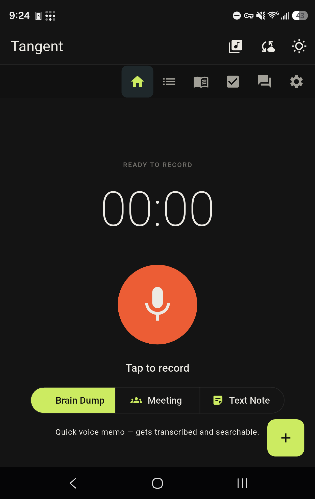
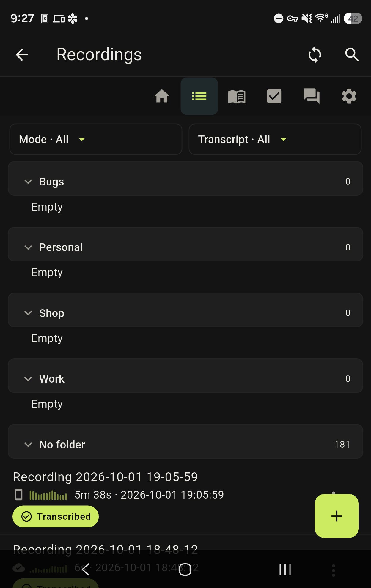
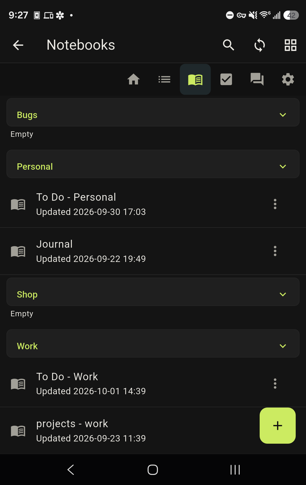
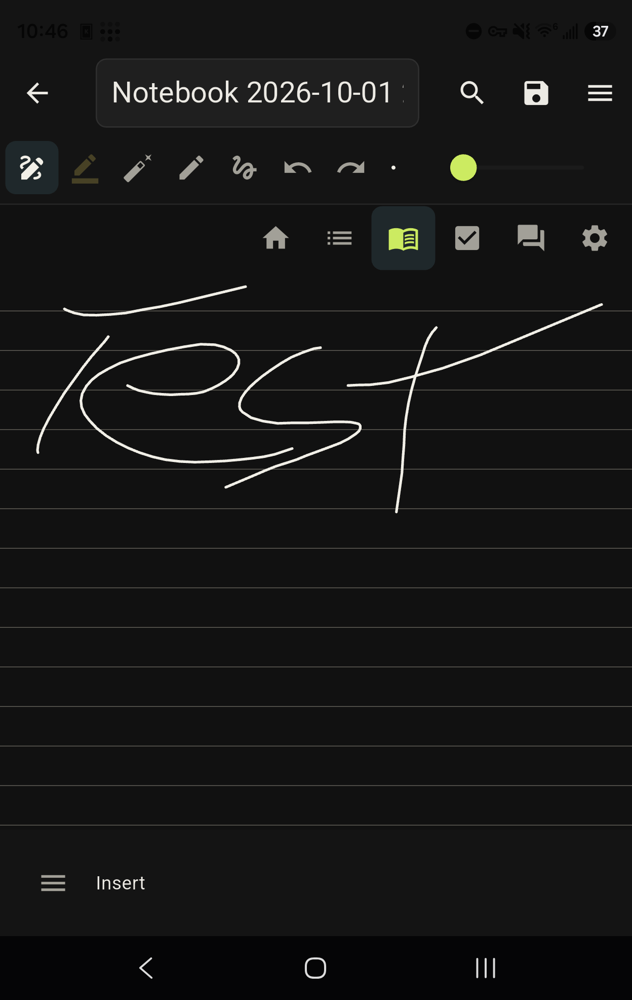
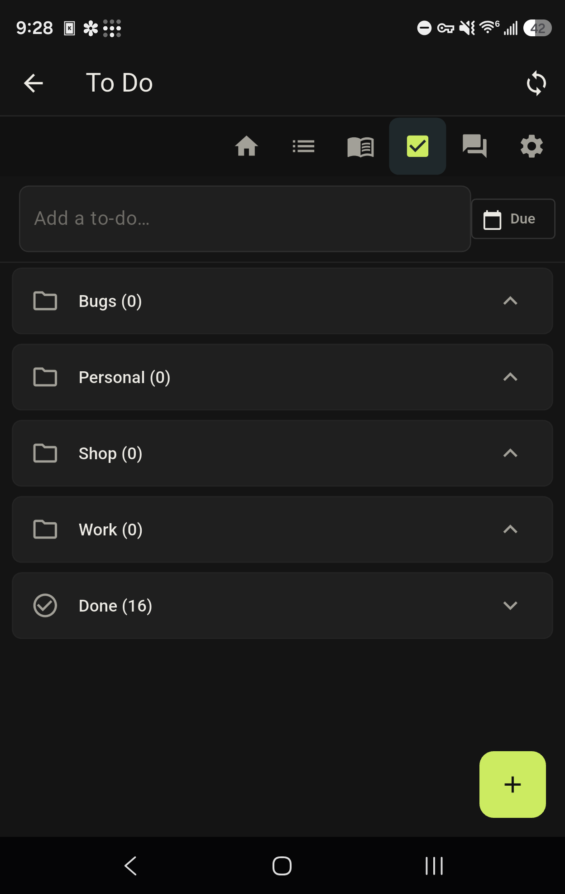
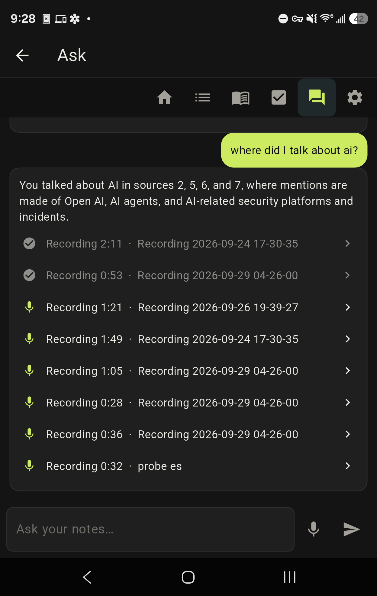
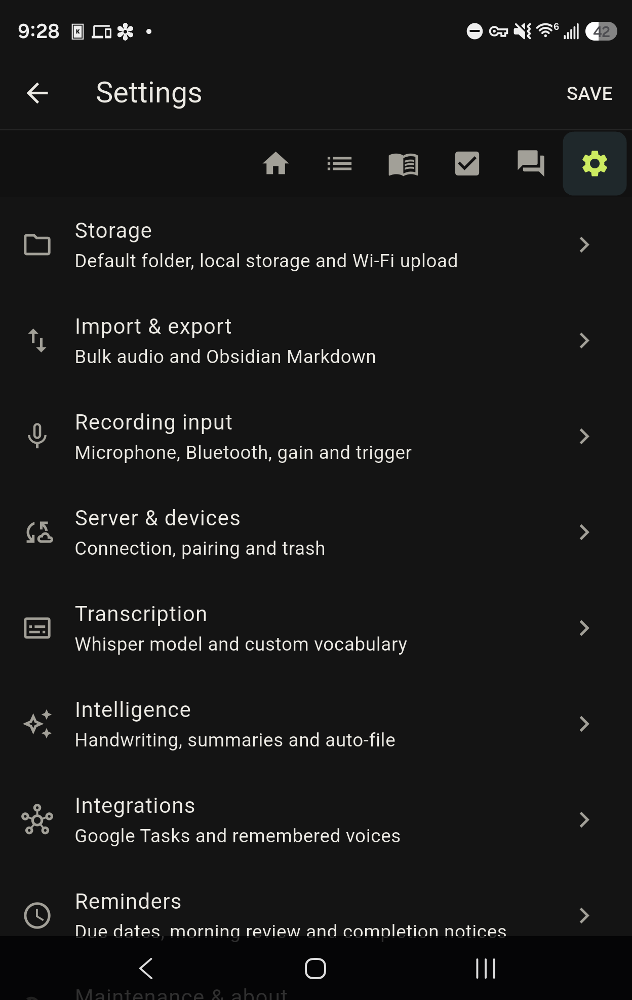
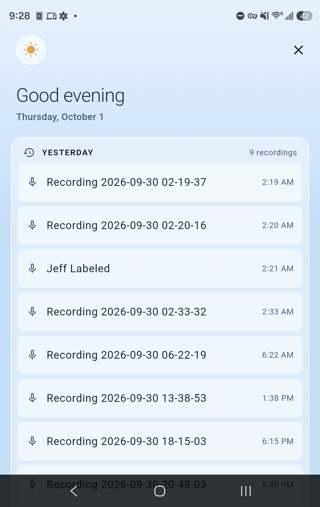

# Tangent — Voice/Text Brain Dumps

[](./LICENSE)
[](./CHANGELOG.md)
[]()
[]()

Tangent records Brain Dumps and Meetings, stores them locally, and transcribes
them on a self-hosted server. It also provides typed notes, notebooks, to-dos,
full-text search, multi-device sync and Ask My Notes.

Recording, playback, notebooks, to-dos and local search work without a server.
Transcription, server-backed AI features and multi-device sync require the
Tangent server. Tangent does not send recordings to a third-party service.

## App layout

<table>
  <tr>
    <td align="center"><a href="./docs/user-guide/README.md#capture"></a><br><b>Capture</b></td>
    <td align="center"><a href="./docs/user-guide/README.md#recordings"></a><br><b>Recordings</b></td>
    <td align="center"><a href="./docs/user-guide/README.md#notebooks"></a><br><b>Notebooks</b></td>
    <td align="center"><a href="./docs/user-guide/README.md#notebook-editor"></a><br><b>Notebook editor</b></td>
  </tr>
  <tr>
    <td align="center"><a href="./docs/user-guide/README.md#to-do"></a><br><b>To Do</b></td>
    <td align="center"><a href="./docs/user-guide/README.md#ask"></a><br><b>Ask</b></td>
    <td align="center"><a href="./docs/user-guide/README.md#settings"></a><br><b>Settings</b></td>
    <td align="center"><a href="./docs/user-guide/README.md#morning-review"></a><br><b>Morning review</b></td>
  </tr>
</table>

Every screenshot links to the [user guide](./docs/user-guide/README.md), which
documents each screen button by button.

The Instrument interface has Anodized (dark) and Aluminium (light) themes. Lime
marks selection and primary create actions; red is reserved for recording and
destructive actions.

A six-key rail appears on top-level screens:

- **Capture** — Brain Dump, Meeting and Text Note capture
- **Recordings** — recordings, transcripts, summaries and folders
- **Notebooks** — handwriting, typed blocks and embedded recordings
- **To Do** — tasks, due dates, folders and Google Tasks sync
- **Ask** — questions grounded in recordings, summaries, notebooks and to-dos
- **Settings** — nine categories: Storage, Import & export, Recording input,
  Server & devices, Transcription, Intelligence, Integrations, Reminders, and
  Maintenance & about

Long-press recordings, notebooks and to-dos to move, rename, delete or pin them.
Long-press an Ask source chip to act on its underlying item. When enabled, the
full-screen morning review shows all of yesterday's captures, due and overdue
to-dos, and pinned items.

## Capture modes

- **Brain Dump** — voice memo with a verbatim transcript
- **Meeting** — speaker-aware transcript and meeting notes
- **Text Note** — typed note without audio

Notebooks combine handwriting, typed blocks and recording cards on a scrolling
page. They support pen styles, palm rejection, erasing, lasso selection,
undo/redo, shared folders and PDF export. Editors save on back.

**Handwriting search** finds your handwritten notes by what you wrote. Type a
word: the Notebooks list shows which notebooks match with a count and a
snippet, and opening one jumps straight to the match with the word
highlighted on your real ink — next/prev walks the matches, Ctrl+F style.
Recognition runs **on the server**, so search works on every device that
syncs, Linux desktop included (no on-device recognizer needed anywhere). The
resulting index syncs back down, so **searching itself is local and offline**.
It is **off by default**: turn it on in Settings → Intelligence → Handwriting search, which
installs the recognition model with progress notifications (a CPU and an RTX
GPU flavour — the GPU one is the *same model running faster*, not more
accurate). Turning it off removes the model and the index.

**Multi-device sync** keeps notebooks, notes and recordings consistent across
your devices through the server: each device pairs once (a 6-digit code, no
token copying), then pushes and pulls changes with per-device change
tracking.

**Import audio** pulls an existing file (a voice memo from another app, a
meeting recording someone sent you) into Tangent and treats it like anything
you recorded yourself.

### Voice

**Hands-free recording (Android).** Two triggers start a Brain Dump with no
further tap — the trigger is the consent — and either fired again while
recording stops it: the **1×1 mic widget** on the home screen (the launcher
icon's palette: black tile, lime mic, purple dot) and the **Record** shortcut
(long-press the Tangent launcher icon). Both fire the same `tangent://record`
deep link and land on the same code path as the on-screen button and the
desktop hotkey, so they can never diverge; if the app is in Text Note mode
the trigger flips it to Brain Dump first. From a **locked phone** the widget
starts the recording over the lock screen and a second tap stops it — anything
beyond stop (review, edit, lists) asks for the unlock.

**Spoken calendar events (v1.35.0).** Say *"add this to my calendar dentist
Thursday at 2"* (or *"add the dentist Thursday at 2 to my calendar"*, *"put
that on my calendar…"*, *"calendar this…"*) in a Brain Dump or Meeting and
the event lands on your primary Google Calendar on the server's next sync
tick — date + time makes a one-hour event, a date alone makes an all-day
one. The recording shows an **Added to your calendar** card with a link to
the Google event and an Undo. Say it in a Brain Dump with no date and the
event goes on the recording's day, flagged *no date said — tap to fix*; in a
Meeting a date-less phrase is ignored (people say it conversationally
there). Needs the Google link from Settings → Integrations → Google with the calendar
permission — enable the **Google Calendar API** in the same Cloud project as
Tasks, and tap **Reconnect** once after updating the server so the token
carries `calendar.events.owned`.

## Quick start

### Prerequisites

| To run | You need |
|---|---|
| **Server** (needed only for transcription + sync) | Docker, **or** Python ≥ 3.11 |
| **Android app** | [Flutter ≥ 3.47](https://docs.flutter.dev/get-started/install) (Dart ≥ 3.13), JDK 17, Android SDK + `adb` — or just sideload the release APK |
| **Linux desktop app** | Flutter ≥ 3.47 on a Linux host, plus `clang`, `cmake`, `ninja-build`, `libgtk-3-dev` |

`flutter doctor` reports missing client build dependencies. Docker runs the
server without a local Python environment.

### Already have a server? Install the APK and pair

1. Download the APK from [Releases](https://github.com/GyratingSeaCow/tangent/releases).
2. Install it over the existing release build:

   **PowerShell**

   ```powershell
   adb install -r .\tangent-vX.Y.Z.apk
   ```

   **bash**

   ```bash
   adb install -r ./tangent-vX.Y.Z.apk
   ```

3. Open Tangent and pair under **Settings → Server & devices**. Use the pairing
   flow first; manual server URL + primary token is the fallback.

### Server setup

**Prebuilt image from GHCR:**

PowerShell:

```powershell
docker run -d --name tangent-server `
  -p 8765:8000 `
  -v tangent-data:/data `
  --restart unless-stopped `
  ghcr.io/gyratingseacow/tangent-server:latest
```

bash:

```bash
docker run -d --name tangent-server \
  -p 8765:8000 \
  -v tangent-data:/data \
  --restart unless-stopped \
  ghcr.io/gyratingseacow/tangent-server:latest
```

**Docker Compose (builds locally):**

```bash
git clone https://github.com/GyratingSeaCow/tangent.git
cd tangent/server
docker compose up -d
```

**From source:**

```bash
git clone https://github.com/GyratingSeaCow/tangent.git
cd tangent/server

python -m venv .venv                 # do not install into system Python
source .venv/bin/activate            # Windows: .venv\Scripts\activate
pip install -e ".[dev]"

python -m uvicorn app.main:create_app --factory --host 0.0.0.0 --port 8000
```

Run first-run setup once to name the server and mint its primary token.

PowerShell (Docker host port):

```powershell
$body = @{ display_name = "Tangent Server" } | ConvertTo-Json
Invoke-RestMethod -Method Post -Uri http://localhost:8765/v1/setup `
  -ContentType "application/json" -Body $body
```

bash:

```bash
curl -X POST http://localhost:8765/v1/setup \
  -H "Content-Type: application/json" \
  -d '{"display_name": "Tangent Server"}'
```

**Save the token somewhere safe** — it is only shown once, and it is the
server's primary credential. But you no longer need to type it into your
devices: they pair instead (next section).

> The container listens on 8000 internally and `docker-compose.yml` maps it to
> **8765** on the host. Change the left-hand number there if you want a
> different host port.

### Client (Android)

**Easiest: download the APK from [Releases](https://github.com/GyratingSeaCow/tangent/releases)**
and sideload it (`adb install -r tangent-vX.Y.Z.apk`, or just open the file on
the phone). No toolchain needed. Releases from v1.3.0 onward are signed with
the project's release key; Android may still warn about installing from
outside Play, which is normal for sideloaded apps. If you previously
installed a locally-built (debug-signed) copy, uninstall it once before
installing a release APK — the signatures differ.

**Or build it yourself:**

```bash
cd client
flutter pub get
flutter build apk --debug
# Output: client/build/app/outputs/flutter-apk/app-debug.apk
```

If Gradle cannot find a JDK, point it at one explicitly — use forward slashes
on Windows so the path survives the shell:

```bash
export JAVA_HOME="C:/Program Files/Microsoft/jdk-17.0.20.8-hotspot"
export ANDROID_HOME="$LOCALAPPDATA/Android/Sdk"
```

Install:

```bash
adb install -r client/build/app/outputs/flutter-apk/app-debug.apk
```

On first launch:

1. Tap "Get started"
2. Authorize Documents or the existing Tangent recording folder
3. Start talking — big red mic button on the home screen
4. Review recordings with the in-app player and draggable seek bar
5. To transcribe or sync, connect the app to your server (next section)

Recording, playback, notebooks and search need no server at all. Only
transcription and multi-device sync do.

### Connecting the app to your server (pairing)

There are **two ways the app can reach your server**, and which one you
pair with decides where the app works:

| Pair with… | Works at home (same Wi-Fi) | Works away from home (cellular, other Wi-Fi) |
|---|---|---|
| the **LAN address** (for example `192.168.1.100`) — what **Find my server** returns | yes | no |
| the **Tailscale address** (for example `100.64.0.10`) | yes | yes |

**If you ever want to use Tangent away from home, pair with the Tailscale
address.** Nothing else changes — the same code, the same token — only the
address the app stores. Find your server's Tailscale address with
`tailscale ip -4` on the server machine, or from the Tailscale admin
console.

> **Symptom to recognise:** a recording sits on "Uploading audio to your
> server" indefinitely when you are away from home, but works the moment
> you are back on home Wi-Fi. The app is paired to the LAN address. Fix:
> **Settings → Server & devices**, replace the address with
> `http://100.64.0.10:8765` (using your server's actual Tailscale address),
> then Save. **Find my server** only discovers servers on the current LAN.

#### Option A — pair over Tailscale (works everywhere)

1. Install [Tailscale](https://tailscale.com) on the server machine and on
   the device, sign both into the same tailnet, and confirm the device can
   see the server (tap the server in the Tailscale app → it shows online).
2. On the device, open **Settings → Server & devices**. Ignore **Find my server**.
   In the **Server URL** field enter `http://100.64.0.10:8765` (using the
   server's actual Tailscale address), then tap **Pair**.
3. The server prints a **6-digit code** to its log. Read it there:

   ```powershell
   # Windows PowerShell:
   docker compose -f path\to\tangent\server\docker-compose.yml logs tangent-server --since 2m | Select-String code_issued
   ```

   ```bash
   # Linux/macOS:
   docker compose logs tangent-server --since 2m | grep code_issued
   ```

4. Type the code into the app. Done — the device holds its own token and
   reaches the server from anywhere the tailnet does.

On Windows, make sure the firewall allows the port in from the Tailscale
interface (it is *not* covered by the rule Docker Desktop adds for the LAN):

```powershell
New-NetFirewallRule -DisplayName "Tangent server 8765" -Direction Inbound -Protocol TCP -LocalPort 8765 -Action Allow -Profile Any
```

#### Option B — pair on the local network (home only)

1. On the device, open **Settings → Server & devices** and tap **Find my server**. The
   app sweeps your local network and lists every Tangent server it finds
   (name, address, version) within a few seconds.
2. Tap **Pair** next to your server.
3. Read the 6-digit code from the server log (commands above) and type it
   into the app.

Pairing this way stores the LAN address; the app will only reach the
server while on the same network. Switch to the Tailscale address later
under **Settings → Server & devices** at any time — no re-pairing needed.

**Why a code?** It proves you control the server, not just its network. The
code is never sent to the requesting device, expires in **120 seconds**, is
stored only as a hash, and dies after 5 wrong attempts. Each device gets its
own revocable token, so a lost phone can be cut off without re-pairing
everything else:

```bash
curl -X DELETE http://localhost:8765/v1/devices/<device-id>/token \
  -H "Authorization: Bearer ***"
```

**Token instead of a code:** the same screen also accepts a URL + the
primary token from setup directly, for scripted or headless installs.

> **Note for pairing:** tap Pair on the device *first*, then read the log —
> the code is only generated when the device asks, and it expires quickly.

### Desktop (Linux)

Download the **AppImage** from
[Releases](https://github.com/GyratingSeaCow/tangent/releases): download
`Tangent-x86_64.AppImage`, `chmod +x` it, and run. Requires `fuse2` on
Arch-family distros; GTK3 is assumed present. libmpv and its codec stack
ride inside the AppImage.

What the Linux desktop build does (verified on CachyOS/KDE Plasma
Wayland):

- **Recording** via PipeWire (`parecord` + `ffmpeg`, both required on
  PATH) with the same Opus pipeline as Android, and playback of synced
  audio via libmpv. The record button waits for mic-stream evidence
  before reporting "recording", so first words aren't clipped.
- **System tray**: Tangent lives in the tray. Left-click opens the
  window, right-click gives Open App / Start Recording / Exit. Closing
  the window (X) hides to the tray; Exit in the tray menu quits.
- **Global record hotkey**: a second invocation `tangent --record`
  forwards a toggle to the running instance over a Unix socket — bind
  that command to a key (KDE: System Settings → Shortcuts → Add
  Command) and you can start/stop a capture from anywhere.
- **Right-click = long-press** everywhere in the app (multi-select,
  folder actions), and PDF export lands in `Documents/Tangent/Exports/`
  and opens in your viewer (no share sheets on desktop).
- **Storage** uses real directories (`~/Documents/Tangent/`) — no
  folder-authorization step. Secure credential storage needs a Secret
  Service (KWallet ≥ 5.97 or gnome-keyring); without one the app still
  runs, unpaired, and says why.

Build from source (must be on a Linux host — Flutter doesn't
cross-compile desktop; Windows builds below):

Build dependencies (Debian/Ubuntu names; the same packages the release
workflow installs — Arch: the matching `-dev`-less packages):

```bash
sudo apt-get install -y clang cmake ninja-build pkg-config libgtk-3-dev \
  liblzma-dev libmpv-dev libsecret-1-dev libjsoncpp-dev \
  libayatana-appindicator3-dev libkeybinder-3.0-dev libnotify-dev
```

```bash
cd client
flutter build linux
# Output: client/build/linux/x64/release/bundle/tangent

# Optional: package it as an AppImage (needs appimagetool)
../packaging/build-appimage.sh
# Output: packaging/out/Tangent-x86_64.AppImage
```

### Desktop (Windows)

Download `tangent-setup-x64.exe` from
[Releases](https://github.com/GyratingSeaCow/tangent/releases) and run
it. It installs per-user (no admin prompt) under
`%LOCALAPPDATA%\Programs\Tangent`, adds a Start Menu entry, and offers
an optional desktop icon and start-at-sign-in. The installer is
unsigned (self-hosted AGPL software has no code-signing budget), so
SmartScreen will ask once — More info → Run anyway.

The Windows app matches the Linux one feature for feature:

- **Recording** to WAV via Media Foundation (Windows has no Opus
  encoder; the server decodes either, accuracy is identical), playback
  via libmpv.
- **System tray**, close-to-tray, and **single instance** — launching
  Tangent again just focuses the running window.
- **Global record hotkey: Ctrl+Alt+R**, registered by the app itself
  (no shortcut setup needed); works while the window is hidden.
- Find my server, handwriting search, summaries, PDF export to
  `Documents\Tangent\Exports\` — all as on Linux.

Build from source (on a Windows host with Visual Studio 2022 Build Tools
including the *C++ ATL* component — `flutter_secure_storage` needs
`atlstr.h`):

```powershell
cd client
flutter build windows --release
# Output: client\build\windows\x64\runner\Release\tangent.exe

# Optional: package the installer (needs Inno Setup 6)
bash ../packaging/build-windows-installer.sh
# Output: packaging\windows\out\tangent-setup-x64.exe
```

---

## Updating

### Server

PowerShell (GHCR container):

```powershell
docker pull ghcr.io/gyratingseacow/tangent-server:latest
docker stop tangent-server
docker rm tangent-server
# Re-run the docker run command from Server setup.
```

bash:

```bash
# GHCR image:
docker pull ghcr.io/gyratingseacow/tangent-server:latest
docker stop tangent-server && docker rm tangent-server
# then re-run the docker run command from Server setup (the volume keeps your data)

# Docker Compose:
cd tangent/server
git pull
docker compose up -d --build
```

Database migrations run automatically on startup; your data directory
(`./data` or the `tangent-data` volume) survives every update. Paired
devices stay paired — tokens live in the database, not the container.

### Handwriting search: GPU acceleration (optional)

Handwriting recognition runs on the CPU by default and needs no setup. If the
server has an NVIDIA GPU you can hand it through with the opt-in override
file, which changes **speed only** — it is the same recognition model either
way, so accuracy is identical:

```bash
cd tangent/server
docker compose -f docker-compose.yml -f docker-compose.gpu.yml up -d --build
```

Pass **both** `-f` flags on every later `docker compose` call for this stack,
or Compose falls back to the CPU-only stock file. The stock
`docker-compose.yml` is untouched so a GPU-less machine keeps working as-is.

The recognition environment (~9 GB) installs into the data volume, so it
survives container rebuilds and does not need reinstalling after an update.

### Android app

Install the new APK over the old one — data is kept:

PowerShell:

```powershell
adb install -r .\tangent-vX.Y.Z.apk
```

bash:

```bash
adb install -r ./tangent-vX.Y.Z.apk
```

> **After every reinstall, Android revokes the storage folder grant.** The
> first time you open the app after updating, re-authorize the Tangent
> folder when prompted (about 10 seconds). This is Android's Storage Access
> Framework behavior, not a bug.

Debug and release builds are signed differently — switching between them
requires a one-time uninstall, which deletes local data. Stick to one flavor.

---

## How it works

```
┌──────────────────────────────────────────────────────────────┐
│ Tangent Client (Flutter — Android / Linux / Windows)         │
│                                                              │
│  Mic button ──► opus recording (16kHz mono, ~32kbps)         │
│       │                                                      │
│       ▼                                                      │
│  Local playback + seek + notebooks + FTS5 search            │
│       │                                                      │
│       ▼                                                      │
│  Local transcript persistence + SQLite FTS5 search          │
│       │                                                      │
│       ▼                                                      │
│  Optional sync ──► upload/pull changes when paired           │
└──────────────────────┬───────────────────────────────────────┘
                       │ HTTP(S), device-bound bearer token
                       ▼
┌──────────────────────────────────────────────────────────────┐
│ Tangent Server (FastAPI + SQLite + faster-whisper)          │
│                                                              │
│  /v1/server/info/public GET (unauthenticated discovery)      │
│  /v1/pair/request  POST (open pairing; code goes to the log) │
│  /v1/pair/claim    POST (code → device-bound token)          │
│  /v1/pair/pending  GET  (pending pairings, for authed UIs)   │
│  /v1/devices/{id}/token DELETE (revoke one device)           │
│  /v1/devices       POST (register), /v1/sync/pull + /push    │
│  /v1/dumps         POST/GET/PATCH/DELETE (CRUD)              │
│  /v1/dumps/{id}/audio POST (multipart) / GET (download)      │
│  /v1/dumps/{id}/transcribe POST (enqueue job)               │
│  /v1/jobs/{id}     GET (poll status)                         │
│  /v1/jobs/{id}/stream GET (Server-Sent Events)               │
│  /v1/setup         POST (first-run token generation)         │
│  /v1/server/info   GET (version, model list, storage stats)  │
│  /v1/models        GET (list), POST /pull (download model)   │
│                                                              │
│  Storage: <data_dir>/tangent.db + <data_dir>/audio/*.opus    │
└──────────────────────────────────────────────────────────────┘
```

## REST API

The server publishes OpenAPI documentation. Open
**`http://192.168.1.100:8765/docs`** (using the server's actual address) or
fetch **`/openapi.json`**.

All data routes require the bearer token you got at setup. A complete
transcription round-trip from the shell:

```bash
TOKEN="your-device-token"
BASE="http://192.168.1.100:8765"   # wherever YOUR server lives

# 1. create a dump
curl -X POST "$BASE/v1/dumps" -H "Authorization: Bearer $TOKEN" \
  -H "Content-Type: application/json" \
  -d '{"id":"dump-cli-001","mode":"brain_dump","duration_seconds":5,
       "title":"Grocery thoughts","created_at":"2026-09-23T12:00:00Z"}'

# 2. attach the audio (multipart field: audio)
curl -X POST "$BASE/v1/dumps/dump-cli-001/audio" \
  -H "Authorization: Bearer $TOKEN" \
  -F "audio=@recording.opus;type=audio/ogg"

# 3. queue transcription
curl -X POST "$BASE/v1/dumps/dump-cli-001/transcribe" \
  -H "Authorization: Bearer $TOKEN" -H "Content-Type: application/json" \
  -d '{"model":"large-v3","request_id":"request-cli-001"}'
# → {"id":"<job_id>","status":"queued",...}

# 4. poll the job (or stream it: GET /v1/jobs/<job_id>/stream is SSE)
curl "$BASE/v1/jobs/<job_id>" -H "Authorization: Bearer $TOKEN"

# 5. the finished transcript lands on the dump
curl "$BASE/v1/dumps/dump-cli-001" -H "Authorization: Bearer $TOKEN"
```

This exact sequence runs in CI (`server/tests/test_readme_api_walkthrough.py`),
so if a route or payload shape ever changes, this section fails the build
until it's updated. Every endpoint's description in `/docs` is enforced by
test too — an undocumented route can't ship.

### Privacy & data ownership

- **Audio never leaves your device unless you sync to a server you control.**
- Server stores uploaded audio as ordinary files under `<data_dir>/audio/`,
  preserving a supported extension such as `.opus`, `.wav`, `.mp3` or `.m4a`.
- Tokens use the platform credential store through `flutter_secure_storage`.
- Pairing codes are stored **hashed** on the server and never transmitted to
  the requesting device; each device holds its own revocable token.
- The unauthenticated discovery endpoint reveals only the server's name,
  version and that auth is required — no data, counts, or configuration.
- No analytics or telemetry. Optional integrations contact their configured
  providers (for example Google Tasks/Calendar and Hugging Face downloads).

---

## Development

### Run all tests

```bash
# Server (Python)
cd server
python -m pytest                # 185 passed, 3 skipped

# Client (Flutter)
cd client
flutter test                    # 1623 widget + unit tests
flutter analyze                 # No issues found

# Android native (Kotlin) — from client/android
./gradlew :app:testDebugUnitTest
```

### Project layout

```
tangent/
├── server/                  # FastAPI + SQLite + Whisper backend
│   ├── app/
│   │   ├── api/             # HTTP endpoints (incl. pairing, sync)
│   │   ├── services/        # transcription, job_queue, storage, secretary
│   │   ├── db.py            # SQLite schema + connection management
│   │   └── main.py          # create_app() factory + lifespan
│   ├── tests/               # pytest
│   └── docker-compose.yml
├── client/                  # Flutter app (Android / Linux / Windows)
│   ├── lib/
│   │   ├── data/            # local_db, audio_storage, secure_storage, settings
│   │   ├── models/          # domain types (Dump, SyncStatus, DumpMode)
│   │   ├── services/        # recording, sync, discovery, pairing, transcription
│   │   └── screens/         # home, dumps, notebooks, server config, settings
│   └── test/
├── docs/                    # design + verification notes
├── AGENTS.md                # agent instructions (subagent-driven dev)
└── CONTRIBUTING.md
```

## License

[AGPL-3.0](./LICENSE).
